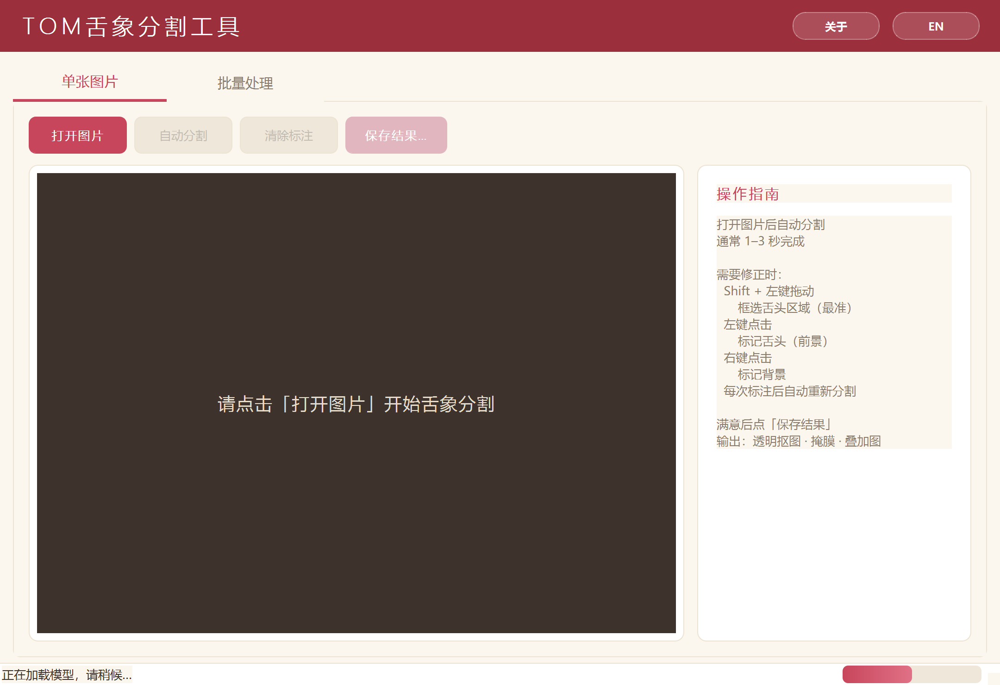
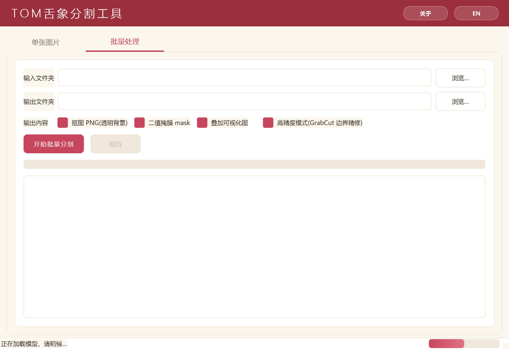

# TOM 舌象分割工具

> AI 驱动的中医舌象智能分割工具

一款面向中医研究与临床的舌象分割桌面工具，自动从舌头照片中分离出舌体区域，支持单张精修和批量处理。

---

## ✨ 功能特性

- 🎯 **一键自动分割** —— 打开图片即自动识别舌头区域，通常 1–3 秒完成
- 🎨 **交互式微调** —— 通过点击 / 框选快速修正分割结果，每次标注后自动重算
- 📁 **批量处理** —— 整个文件夹一次性处理，可同时输出多种格式
- 💾 **三种输出格式** —— 透明背景 PNG · 二值掩膜 · 叠加可视化
- ⚡ **高精度模式** —— 可选 GrabCut 边界精修，更贴合舌体边缘
- 🌏 **中英双语界面** —— 一键切换中文 / English
- 🪟 **绿色安装** —— 双击安装即用，无需 Python / CUDA 环境

---

## 📥 下载安装

从 [**Releases**](../../releases) 页面下载最新版安装程序：

| 文件 | 大小 | 说明 |
|---|---|---|
| `TOM舌象分割工具_安装程序_v3.2.0_nuitka.exe` | 565 MB | 推荐版本 |

双击运行后，在安装向导中选择：
- **语言**：中文 / English（界面语言可在安装后随时切换）
- **安装位置**：默认 `%LOCALAPPDATA%\Programs\TOM舌象分割工具\`
- **桌面快捷方式**：是否创建

安装完成后从开始菜单或桌面快捷方式启动。

---

## 🚀 使用方法

### 单张图片处理

1. 点击 **打开图片**，选择一张舌头照片
2. 等待 1–3 秒，应用自动完成分割
3. 如对结果不满意，可进行交互式微调：
   - **Shift + 左键拖动**：框选舌头区域（最准确）
   - **左键点击**：标记舌头（前景点）
   - **右键点击**：标记背景
   - 每次标注后会自动重新分割
4. 满意后点击 **保存结果**，选择输出文件夹
5. 自动生成三种输出：透明背景 PNG · 二值掩膜 · 叠加可视化图

### 批量处理

1. 切换到 **批量处理** 标签页
2. 选择 **输入文件夹**（内含待处理的舌头图片）
3. 选择 **输出文件夹**
4. 勾选需要的输出类型（抠图 / 掩膜 / 叠加图）
5. 可选：勾选 **高精度模式**（GrabCut 边界精修，每张多耗时约 0.x 秒）
6. 点击 **开始批量分割**
7. 进度条和日志会实时显示处理状态

支持的图片格式：`.jpg` `.jpeg` `.png` `.bmp` `.tif` `.tiff` `.webp`

### 切换语言

点击右上角 **EN / 中** 按钮即可在中英文之间切换。

---

## 📋 系统要求

- **操作系统**：Windows 10 / 11（64 位）
- **内存**：4 GB RAM 以上（推荐 8 GB）
- **磁盘空间**：约 1.5 GB
- **显卡**：可选 GPU 加速（CPU 也能正常运行）

---

## 📖 引用

如本工具对您的研究有帮助，欢迎引用我们的文章：

> Xie, J., Zhang, Z., Poudel, B., Guo, C., Yu, Y., An, G., ... & Xu, D. (2026). **TOM: An open-source tongue segmentation method with multi-teacher distillation and task-specific data augmentation.** *Expert Systems with Applications*, 131499.

🔗 [在 ScienceDirect 查看](https://www.sciencedirect.com/science/article/pii/S0957417426004124)

---

## 🏛️ 研发团队

**[Digital Biology Laboratory (DBL)](https://digbio.missouri.edu/)**
University of Missouri

如本工具对您有帮助，欢迎给我们一个 ⭐ Star 以获取后续更新通知。

---

## 📄 版权

© 2026 Digital Biology Laboratory · University of Missouri
